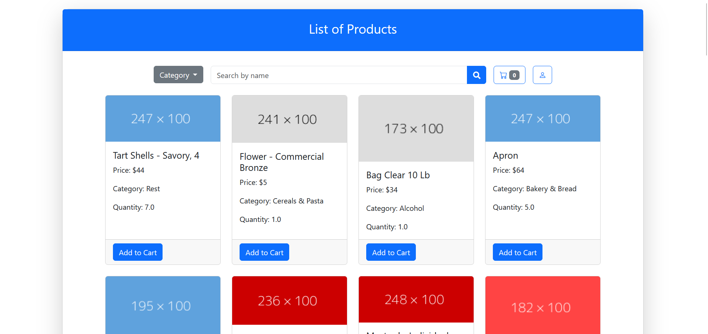

# Online Grocery Shop


A full‑stack demo web‑application for managing an online grocery store: browse products by category, search, add to cart, and checkout. 100 % Dockerised — one command spins up both the Spring Boot back‑end and the MySQL database seeded with sample data.

## 🖼️ Screenshot

| Catalogue                            |
|--------------------------------------|
|  | 


## 🚀 Quick Start

```bash
# 1 · Clone the repository
git clone https://gitlab.rz.uni-bamberg.de/dsg/thesis/bachelor-thesis-valkova.git
cd bachelor-thesis-valkova

# 2 · Create and fill the .env file
cp .env.example .env
# edit .env and set
# MYSQL_ROOT_PASSWORD=<your-password>
# SPRING_DATASOURCE_PASSWORD=<your-password>

# 3 · Build the application
./gradlew clean build

# 4 · Run everything with Docker Compose
docker compose up --build
```

Now open in your browser: http://localhost:8080/products


## 🔐 Environment Variables

| Variable                    | Purpose                                           | Example value               |
|-----------------------------|---------------------------------------------------|-----------------------------|
| `MYSQL_ROOT_PASSWORD`       | Password for the MySQL **root** user (used by the database container at start-up). | `my_strong_root_pw`         |
| `SPRING_DATASOURCE_PASSWORD`| Spring Boot reads this at runtime and passes it to the JDBC URL. | `my_strong_root_pw`         |

## 🛠 Tech Stack

| Layer      | Technology                                                                           |
|------------|--------------------------------------------------------------------------------------|
| Language   | Java 21                                                                              |
| Back-end   | Spring Boot · Spring Data JPA · Spring Security                                      |
| Database   | MySQL                                                                              |
| Front-end  | Thymeleaf · Bootstrap 5                                                              |
| Build/Run  | Gradle · Docker Compose                                                              |

